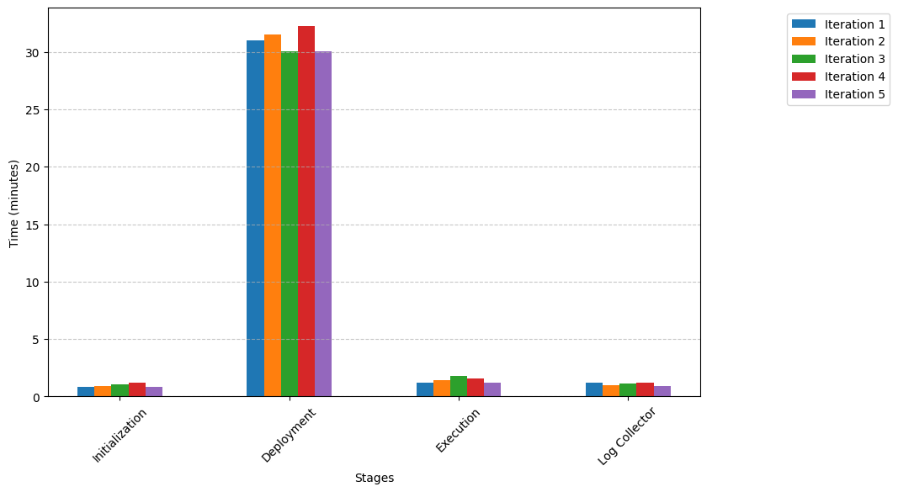

# Evaluating CCSIM runtime

Scalability in large-scale simulation environments is essential for evaluating complex distributed architectures. Beyond the ability to support high-demand scenarios, it is crucial to maintain stable execution times to optimize the developer's experience. Consistent runtimes allow developers to plan their workflows more effectively, ensuring predictable performance when scaling applications. This is particularly important in continuous integration and testing pipelines, where unpredictable simulation times can hinder automation and delay software releases.

## Experiment Setup
To validate CCSIM’s scalability, we conducted a series of experiments measuring execution times across different **pricing plans** using the _Air Quality App_ as a test case. Each experiment was repeated **five times per plan** to ensure reliability and consistency in the results. The tests simulated the **worst-case scenario**, deploying the **maximum number of devices** supported by each plan.

Each experiment evaluated the full CCSIM workflow, which includes the following stages:

1.  **Initialization** – Configuring the simulation environment.
2.  **Deployment** – Provisioning AWS EC2 instances and launching all containers.
3.  **Execution** – Running tests within the simulated environment.
4.  **Log Collection** – Retrieving logs and performance data for analysis.

### Basic Plan (vCPU: 96 and RAM: 192 GB)
- **X** switches
- **X** microservices
- **X** mobile devices
- **X** edge nodes
- **X** cloud instances

### Pro Plan (vCPU: 128 and RAM: 512 GB)
- **X** switches
- **X** microservices
- **X** mobile devices
- **X** edge nodes
- **X** cloud instances

### Enterprise Plan (vCPU: 192 and RAM: 768 GB)
- **X** switches
- **X** microservices
- **X** mobile devices
- **X** edge nodes
- **X** cloud instances

Each experiment evaluated the full CCSIM workflow, which includes **Initialization, Deployment, Execution, and Log Collection** stages.

## Results and Analysis

### **1. Runtime Consistency Over Multiple Iterations – Enterprise Plan**

📌 **Image:** `enteprise-plan.png`  
📊 **Description:**  
This figure shows the execution time of the **Enterprise Plan** across **five iterations** to verify simulator stability.

🔎 **Analysis:**

-   **Minimal differences between iterations**, confirming **predictable execution times**.
-   **Deployment remains the most time-consuming stage**, yet it stays stable across executions.
-   **This consistency is crucial for CI/CD workflows**, where unpredictable execution times can disrupt automation.

----------

### **2. Runtime Consistency Over Multiple Iterations – Pro Plan**

📌 **Image:** `PRO-plan.png` 
 
📊 **Description:**  
This figure presents the same evaluation as the **Enterprise Plan**, but for the **Pro Plan**.

🔎 **Analysis:**

-   **Execution times remain stable across iterations**, with slight variations.
-   **The pattern is similar to the Enterprise Plan**, but with a **shorter deployment time** due to fewer deployed devices.
-   **The other workflow stages show almost identical times**, reinforcing that most variability comes from deployment.

----------

### **3. Runtime Consistency Over Multiple Iterations – Basic Plan**

📌 **Image:** `basic-plan.png`  
📊 **Description:**  
This figure shows execution time stability for the **Basic Plan** across **five iterations**.

🔎 **Analysis:**

-   **Negligible differences between iterations**, confirming that CCSIM is **consistent across all pricing plans**.
-   **Deployment time is lower compared to higher-tier plans**, as fewer devices are deployed.
-   **Initialization, Execution, and Log Collection times remain constant**, reinforcing that deployment accounts for most runtime variability.

### **4. Execution Time Across Different Pricing Plans**

📌 **Image:** `pricingplans.png`  
📊 **Description:**  
This figure shows the average execution time for each **workflow stage** in CCSIM across different **pricing plans** (**Basic, Pro, and Enterprise**).

🔎 **Analysis:**

-   **Total execution time increases with higher-tier plans**, from **~28 minutes in the Basic plan to ~40 minutes in the Enterprise plan**.
-   **Deployment is the slowest stage**, accounting for **82% of the total execution time** across all plans.
-   **Initialization, Execution, and Log Collection remain relatively low and stable**, indicating that deployment is the main bottleneck.
-   **The error bars are small**, meaning there is little variation between runs, validating the simulator’s stability.

### Key Observations

- **Deployment Stage Dominance**: The deployment phase accounts for approximately **82% of the total runtime**, primarily due to the time required for AWS EC2 instance provisioning and container deployment. Although higher pricing plans provide more resources, the virtualization tools used are not fully optimized for scaling large deployments, leading to increased deployment times as the number of devices grows.

- **Consistency Across Experiments**: Despite differences in plan configurations, CCSIM maintained simulation runtimes within the range of **28–40 minutes**, demonstrating predictable performance at scale.

## Importance of Consistency for Developers

For developers integrating CCSIM into their workflows, predictable and stable simulation runtimes offer several advantages:

- **Reliable Testing Pipelines**: Ensuring that tests complete within expected time frames allows seamless integration with CI/CD processes.
- **Scalable Evaluation**: Developers can confidently scale their simulations without facing unpredictable delays.

This validation confirms that CCSIM is capable of supporting large-scale simulations while maintaining execution times that remain within a reasonable and predictable range.
